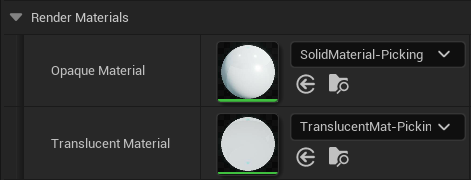
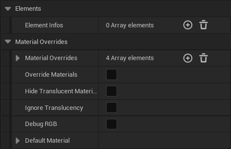
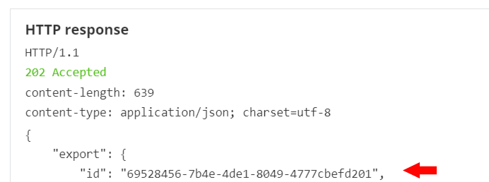

# Unreal Engine 3DFT Plugin

## Table of contents

1. [Pre-requisites](#pre-requisites)
2. [Compile the project manually and debug it](#compile-the-project-manually-and-debug-it)
3. [Technology overview](#technology-overview)
4. [Plugin](#plugin)
5. [iTwin Platform](#itwin-platform)

## Pre-requisites

### Mac

Please, follow the url links to get detailed instructions on how to install the described applications.

1. Install [Unreal Engine](https://docs.unrealengine.com/5.0/en-US/installing-unreal-engine/) (we recommend **5.0.3** at the time of writing this documentation)

2. Install[XCode 13.x](https://developer.apple.com/support/xcode/) (Unreal Engine only supports XCode up to version 13.x at the time of writing this documentation, so you cannot install version 14 released during summer 2022.)

3. After XCode is installed, launch it to make sure it installs the command line tools and you accept the necessary terms and conditions. You can then close XCode.

4. Open the .uproject file at the root of this repository. Unreal Engine should offer you to build the plugin from source and proceed to load the editor.

5. If Unreal Engine shows errors when loading the .uproject, [compile it manually](#compile-the-project-manually-and-debug-it).

### Windows

Please, follow the url links to get detailed instructions on how to install the described applications.

1. Install [Unreal Engine](https://docs.unrealengine.com/5.0/en-US/installing-unreal-engine/) (we recommend **5.0.3** at the time of writing this documentation)

2. Install [Visual Studio](https://docs.unrealengine.com/5.0/en-US/setting-up-visual-studio-development-environment-for-cplusplus-projects-in-unreal-engine/) or [Visual Code](https://docs.unrealengine.com/5.0/en-US/setting-up-visual-studio-code-for-unreal-engine/).

3. Open the .uproject file at the root of this repository. Unreal Engine should offer you to build the plugin from source and proceed to load the editor.

4. If Unreal Engine shows errors when loading the .uproject, [compile it manually](#compile-the-project-manually-and-debug-it).

 

## Compile the project manually and debug it

### Mac

You can generate the XCode project files from a terminal using a script provided by the Unreal Engine. This will generate a XCode Workspace which will allow you to build the plugin and run it from the debugger.

1. Open a terminal and run the following command :
/Users/Shared/Epic\ Games/UE_5.0/Engine/Build/BatchFiles/Mac/GenerateProjectFiles.sh /path/to/your/iModel.uproject

2. Locate the file named iModel.xcworkspace which should have been created in the same location than the .uproject file and open it. This should open XCode.

3. Click the run button in XCode, this should build and start the Unreal Engine Editor.

4. Find more information about compiling game projects [here](https://docs.unrealengine.com/5.0/en-US/compiling-game-projects-in-unreal-engine-using-cplusplus/).

### Windows

1. Generate the Visual Studio project file by right-clicking on the .uproject file and selecting *Generate Visual Studio project files*.

&nbsp;&nbsp;&nbsp;&nbsp;&nbsp;&nbsp;

2. You can also generate them manually following these [instructions](https://docs.unrealengine.com/5.0/en-US/how-to-generate-unreal-engine-project-files-for-your-ide/).

3. Use the **Debug** command to run and debug the project. It will automatically run the Unreal Editor with your project loaded.

4. Find more information about compiling game projects [here](https://docs.unrealengine.com/5.0/en-US/compiling-game-projects-in-unreal-engine-using-cplusplus/).

 

## Technology Overview

Engineers are sitting on some incredible models that are too complicated to render in real-time using traditional methods.

3DFT (**3D** **F**ast **T**ransmission) is a new rendering codec that rapidly optimizes/compresses large 3D models for high Unreal Engine framerates, without data loss.

Aimed to achieve the ”4 F’s” (fast encoding, fast transmission, fast decoding, fast rendering) 3DFT defines encoding and decoding methods, a persistence format and a rendering architecture.

3DFT is a fundamental part of [The Bentley iTwin platform](https://www.bentley.com/software/itwin-platform/), a collection of APIs and services designed to help you build digital twin applications and bring them to market quickly. It provides the foundation for building SaaS solutions to design, build, and operate infrastructure assets. Accelerate application development by letting the iTwin platform handle data integration, visualization, change tracking, security, and other complex challenges. Whether you are building SaaS solutions for your clients advancing their digital twin initiatives, or implementing bespoke solutions in your organization, this is the platform for you.

3DFT streams the 3d models stored in the iTwin platform to Unreal Engine directly, without the need to export/import them. The data streaming optimizes the transmission of data so only a fraction of the size of the model is transmitted, instead of exporting/importing the whole model.

 
 

If you want to learn more, click of the image to watch the session about 3DFT that we did at the Unreal Fest 2022.

 

 

## Plugin

### Render Materials

Define the materials that will be used to render the iModel.

There are 2 materials provided by default:

We can create and use our own materials to expand the capabilities of the renderer models.

For example, we have created 2 materials that allows the user to select and high-light individual elements:

### Optimization

Several properties to improve and optimize several aspects of the plugin.

### Elements and Material Overrides

We can beautify the iModel by modifying the original colors and individual elements.

 

## iTwin Platform

If you want to create an iModel for the first time and visualize it in your plugin, follow these steps:

1. Go to the [iTwin Platform developer portal](https://developer.bentley.com/) and create an account.

2. Go to [my models](https://developer.bentley.com/my-imodels/) and create a new iModel.

3. There are several sample iModels that you can use to start playing with the platform. Just create a new iModel, select "Bentley Sample" and choose one of the sample projects.

4. Visualize your model in the platform to make sure that your model has been created correctly.

5. Check the Url of your project to get the parameters **iModelId** and **ChangeSetId**.
For example, you will see a url with this structure:

    https://connect-imodelweb.bentley.com/imodeljs/?projectId=00000000-1111-2222-3333-44444444&iModelId=55555555-6666-7777-8888-99999999&ChangeSetId=abcdefghijklmnopqrstuvwyz012345678
    
    In this case, iModelId is *55555555-6666-7777-8888-99999999* and ChangeSetId is *abcdefghijklmnopqrstuvwyz012345678*.

6. We're going to use the [Mesh Export API](https://developer.bentley.com/apis/mesh-export/) service to convert the iModel to 3DFT.

    1. Go to the [Start Export](https://developer.bentley.com/apis/mesh-export/) page and click on the **Try it out** button.

    2. Click on the dropdown **No auth** and select authorizationCode.

    3. In the **Body** edit box, modify the values of the following parameters:
        - "iModelId": substitute the identifier with the **iModelId** value from the Url that you have previously copied.
        - "changesetId": substitute the identifier with the **ChangeSetId** value from the Url that you have previously copied.
        - "exportType": substitute GLTF for **3DFT**.
    
    4. Press the **Execute** button.

    5. This will start the export process and generate an **HTTP response** with the **id** of the export.
    
        

    6. Check the state of the export using the [Get Export Service](https://developer.bentley.com/apis/mesh-export/operations/get-export/) (Try it out > No auth > configure **id** > Execute).

    7. When the export has been completed, you will receive the Url of the 3DFT:

        

 

7. Use the **href** of the 3DFT on the sample included in this UE project.

