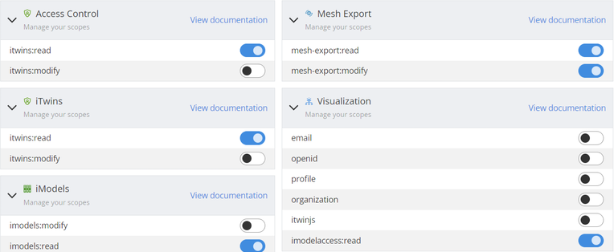
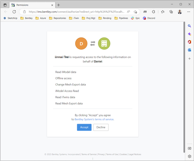
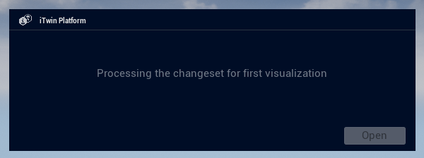
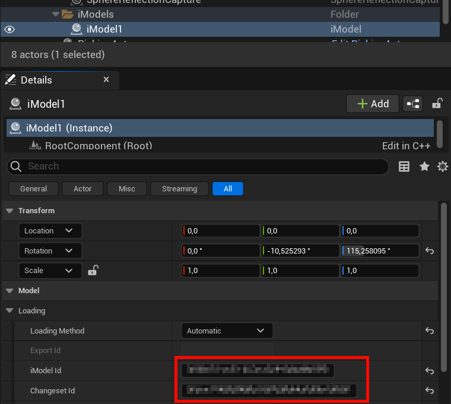
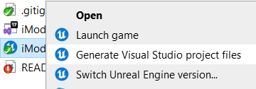
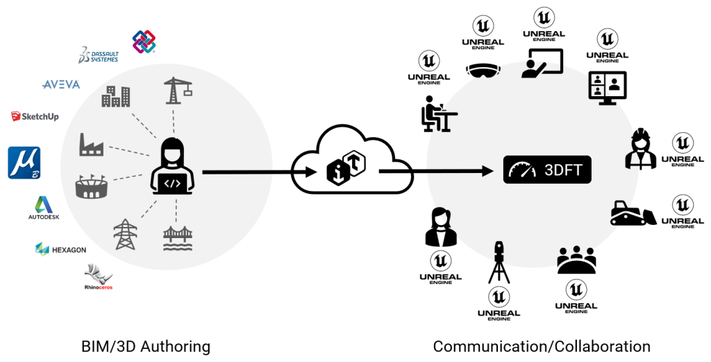

# iTwin 3DFT Plugin for Unreal Engine

This repository contains the iTwin 3DFT Plugin for Unreal Engine for viewing iModels streamed directly from the iTwin Platform.
It also includes sample projects that demonstrate how to use the plugin and how to connect to various APIs of the iTwin platform.

## **Warning: Tech Preview**

This project is a *Technical Preview* and is available for testing purposes only. **Do not use in production**.

You can get more information about the state of the plugin and the iTwin Mesh Export Service [here](https://developer.bentley.com/apis/mesh-export/operations/get-export/).

</br>

## License

This repository is licensed under an [Apache license](./LICENSE.md), except for the iTwin 3DFT native library which is licensed under a [BENTLEY RIGHT-TO-RUN AUTHORIZATION](./Plugins/iTwin/ThirdParty/iModelDecoder/LICENSE.md) license.

<br/>

# Table of contents

1. [Pre-requisites](#pre-requisites)
2. [Usage](#usage)
3. [Limitations](#limitations)
4. [Samples](#samples)
5. [Compile the project manually and debug it](#compile-the-project-manually-and-debug-it)
6. [iModel Actor Properties](#imodel-actor-properties)
7. [Technology overview](#technology-overview)

</br>

## Pre-requisites

### Mac

Please, follow the url links to get detailed instructions on how to install the described applications.

1. Install [Unreal Engine](https://docs.unrealengine.com/5.0/en-US/installing-unreal-engine/) (we recommend **5.0.3** at the time of writing this documentation)

2. Install [XCode 13.x](https://developer.apple.com/support/xcode/) (Unreal Engine only supports XCode up to version 13.x at the time of writing this documentation, so you cannot install version 14 released during summer 2022.)

3. After XCode is installed, launch it to make sure it installs the command line tools and you accept the necessary terms and conditions. You can then close XCode.

4. Open the .uproject file at the root of this repository. Unreal Engine should offer you to build the plugin from source and proceed to load the editor.

5. If Unreal Engine shows errors when loading the .uproject, [compile it manually](#compile-the-project-manually-and-debug-it).

### Windows

Please, follow the url links to get detailed instructions on how to install the described applications.

1. Install [Unreal Engine](https://docs.unrealengine.com/5.0/en-US/installing-unreal-engine/) (we recommend **5.0.3** at the time of writing this documentation)

2. Install [Visual Studio](https://docs.unrealengine.com/5.0/en-US/setting-up-visual-studio-development-environment-for-cplusplus-projects-in-unreal-engine/) or [Visual Code](https://docs.unrealengine.com/5.0/en-US/setting-up-visual-studio-code-for-unreal-engine/).

3. Open the .uproject file at the root of this repository. Unreal Engine should offer you to build the plugin from source and proceed to load the editor.

4. If Unreal Engine shows errors when loading the .uproject, [compile it manually](#compile-the-project-manually-and-debug-it).

</br>

## Usage

1. Create and configure your iTwin Platform account.

    a) Go to the [iTwin Platform developer portal](https://developer.bentley.com/) and create an account.

    b) Go to [My Models](https://developer.bentley.com/my-imodels/) and create a new iModel.

    c) Go to [My Apps](https://developer.bentley.com/my-apps/) and [register a new iTwin App](https://developer.bentley.com/tutorials/quickstart-web-and-service-apps/#12-register-your-application):
      - Application type: Desktop / Mobile
      - Redirect URIs: http://localhost:24363/authorize
      - Scopes:
        ```
        savedviews:read imodels:read mesh-export:read itwins:read mesh-export:modify imodelaccess:read
        ```
        

2. Configure your iTwin *App ID* in the plugin:

    `\Plugins\iTwin\Source\iTwin\Private\iTwinPlatform\iTwinAuthorizationService.cpp`

    ```
    static constexpr auto iTwinAppId = TEXT("your_app_id_goes_here");
    ```

2. Open the sample *iTwinExample* project located in the root folder of this repository (UE should automatically compile the plugin).

3. Explore the sample levels *iModel-Selection-Menu* and *Manual-iModel-Placement* to see the plugin in action.

4. To use the plugin in your own projects, simply copy & paste the plugin in your projects and add the actor(s) provided by the plugin to your levels as shown in the sample levels.

5. Configure the actor(s) settings and the level blueprints to suit your needs.

<br/>

### Login and Access Authorization


Bentley iTwin APIs and SDKs require the end user to give consent to your application to retrieve and use data on user's behalf.

The plugin will automatically open a browser window to let the user login to the iTwin platform and authorize the plugin to access his data.



When the user accepts, the plugin automatically connects to the iTwin server, so the user can now close the browser window.

<br/>

### Model optimization

When the selected Model is opened for the first time, the 3D model is optimized so that it can be viewed at high speed.



The next time any user opens it, it will already have been optimized and will open very quickly.


<br/>

## Limitations

- Textures are not supported
- UV channels are not exported
- Material mapping supports Base Color, Specular, Roughness and Metallic
- Reality Data is not supported
- Saved views API is minimally supported (only certain camera transitions are supported to demonstrate how to transform iModel coordinates)
- Issues API is not supported
- Scheduling animation is not exported.

<br/>

## Samples

<br/>

### iModel-Selection-Menu

This sample demonstrates how to list your iTwins/iModels/Changesets and open them dynamically.


Users can navigate using saved views or click on elements to query its unique value.


<br/>

### Manual-iModel-Placement

This sample demonstrates how to place a specific iModel directly into the scene.

For that, the iModelId and ChangesetId has to be set.

The plugin will automatically optimize the model if necessary before loading it.




<br/>

## Compile the project and debug it manually

### Mac

You can generate the XCode project files from a terminal using a script provided by the Unreal Engine. This will generate a XCode Workspace which will allow you to build the plugin and run it from the debugger.

1. Open a terminal and run the following command :
/Users/Shared/Epic\ Games/UE_5.0/Engine/Build/BatchFiles/Mac/GenerateProjectFiles.sh /path/to/your/iTwinExample.uproject

2. Locate the file named iTwinExample.xcworkspace which should have been created in the same location than the .uproject file and open it. This should open XCode.

3. Click the run button in XCode, this should build and start the Unreal Engine Editor.

4. Find more information about compiling game projects [here](https://docs.unrealengine.com/5.0/en-US/compiling-game-projects-in-unreal-engine-using-cplusplus/).

### Windows

1. Generate the Visual Studio project file by right-clicking on the .uproject file and selecting *Generate Visual Studio project files*.

&nbsp;&nbsp;&nbsp;&nbsp;&nbsp;&nbsp;

2. You can also generate them manually following these [instructions](https://docs.unrealengine.com/5.0/en-US/how-to-generate-unreal-engine-project-files-for-your-ide/).

3. Use the **Debug** command to run and debug the project. It will automatically run the Unreal Editor with your project loaded.

4. Find more information about compiling game projects [here](https://docs.unrealengine.com/5.0/en-US/compiling-game-projects-in-unreal-engine-using-cplusplus/).

<br/>

## iModel Actor Properties

- Loading
    - Loading Method:
        - Automatic: this method will automatically optimize if necessary and load the specific iModel/Changeset.
        - Manual: this method will load the specific export.
    - Object Loading Speed: defines the speed of creation of meshes. Big values produce drops on the framerate.
    - Requests in Parallel: defines the number of tiles that are downloaded in parallel.
    - Use Disk Cache: check this to let Unreal cache the downloaded parts of the iModel. This will speed-up the loading of the iModel the next time you visualize it.

- Render Materials
    - Opaque material: you can select your own materials to expand the capabilities of the renderer models.
    - Translucent material: the same but for translucent materials.

- Optimization
    - Max Triangles per batch: defines the maxium number of triangles that a mesh can have.
    - Shadow Distance Culling: after this distance, objects don't have shadows (improves rendering optimization)

- Geometry quality
    - Near Range: defines the geometry density of the near range objects.
    - Far Range: defines the geometry density of the far range objects.

- Elements
    - Element infos: Manual configuration of elements to change their visibility, offset position and pixel offset.

- Material Overrides
    - Material Overrides: change the visual aspect of a material.
    - Override Materials: activate the material overrides
    - Hide Translucent Materials: do not render translucent objects
    - Ignore Translucency: render all objects as opaque
    - Debug RGB: activate the "debug" mode
    - Default Material: changes the aspect of all the objects in general.

<br/>

## Technology Overview

Engineers are sitting on some incredible models that are too complicated to render in real-time using traditional methods.

3DFT (**3D** **F**ast **T**ransmission) is a new rendering codec that rapidly optimizes/compresses large 3D models for high Unreal Engine framerates, without data loss.

Aimed to achieve the ”4 F’s” (fast encoding, fast transmission, fast decoding, fast rendering) 3DFT defines encoding and decoding methods, a persistence format and a rendering architecture.

3DFT is part of [The Bentley iTwin platform](https://www.bentley.com/software/itwin-platform/), a collection of APIs and services designed to help you build digital twin applications and bring them to market quickly. It provides the foundation for building SaaS solutions to design, build, and operate infrastructure assets. Accelerate application development by letting the iTwin platform handle data integration, visualization, change tracking, security, and other complex challenges. Whether you are building SaaS solutions for your clients advancing their digital twin initiatives, or implementing bespoke solutions in your organization, this is the platform for you.

3DFT streams the 3d models stored in the iTwin platform to Unreal Engine directly, without the need to export/import them. The data streaming optimizes the transmission of data so only a fraction of the size of the model is transmitted, instead of exporting/importing the whole model.



<br/>
<br/>

If you want to learn more, click of the image to watch the session about 3DFT that we did at the Unreal Fest 2022.

<br/>

[](https://www.youtube.com/watch?v=Iag2lJj82m4)

<br/>
